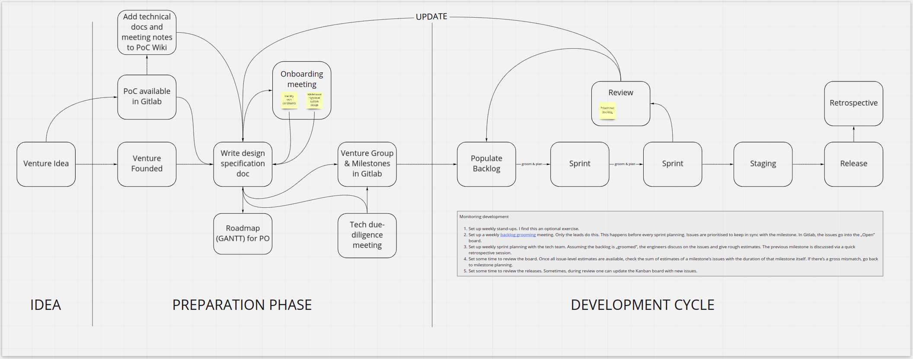

Technical Project Management

Company:		NBT AG

Checked by: 		Martin Maurer

Date:			06.03.2020

Status:			preliminary

Audience:		Tech Team, Product Owners

Index

[[TOC]]

# Important Terms at NBT

* Agile Pair - a pair of two people who combined fulfil the role of a Product Owner. There is always one business person (Founder or Venture Developer) and a technical lead assigned to a venture. There can be edge cases where a VD works alongside a founder for a restricted period of time.

* Milestone - a set of key results that helps us reach a goal (defined in „Purpose"). A project can have several milestones, some follow each other while others run in parallel. The last milestone points to a release. See [Auxolar milestones](https://gitlab.com/groups/auxolar-nbt/-/milestones) towards the pilot (goal).

* Release - a versioned package or shipment that reaches the customer. The release is defined as a story in gitlab. Here’s [an example](https://gitlab.com/auxolar-nbt/solargenius/-/issues/53) of a release-story for Solargenius.

* Story - a user story. A story has multiple issues. Here’s [an example of a story](https://gitlab.com/auxolar-nbt/services/-/issues/25) with multiple issues.

* Issue - a task that is planned and executed by the assigned developer. An issue ends when the „acceptance criteria" are met or a [merge request](https://docs.gitlab.com/ee/user/project/merge_requests/) is accepted. This ensures quality check (to a good degree) on what the developer is building. [See Auxolar’s list of issues](https://gitlab.com/groups/auxolar-nbt/-/issues).

# NBT Technical Development Process

1. Set some time to write up the „hardware/firmware/software design document". See [template](https://docs.google.com/document/d/1GwLIOGRjq12blr6JnF3jel2DaZO_uIbSGNDdxKX-2Ag/edit).
*Hint: The important sections are „Purpose" (or goals) and „Scope“ sections, usually set by the VD lead or founders. The tech lead fills in the „Architectural strategies“ based on the defined scope.*

2. Set up a tech onboarding meeting where hardware, firmware and software requirements are analysed. In software, the outputs of this meeting are:

    1. identifying tech constraints

    2. white-boarding a high-level system design.

*Hint: This also helps in keeping the design document up-to-date. Auxolar’s design document is **[her*e](https://docs.google.com/document/d/1SBRK2OxUDXY6hoJp3QWHii_f_phTOnydiYi81juS-70/edit#)*.*

3. Create a new group on Gitlab for this venture. Add labels. I have a script that does this automatically.

## Roadmap/Milestone planning

1. Set up a monthly or bi-weekly milestone planning meeting.

*Hint: This is where the tech and the VD leads meet to add and update milestones, taking into account the purpose (or goals), the scope and the tech requirements as defined in the design document. When creating milestones, we are,  in essence, asking „What are we aiming to achieve".*

    1. We can name milestones as being of two types: 

        1. sprint milestones (last a week generally; more agile; generally software fits here)

        2. epic milestones (any range of time; less agile; generally hardware and firmware fit here)

2. Set time to update the design document and the Gantt chart.

3. Add some stories to Gitlab’s issues (kanban) board.

*Hint: You can see Auxolar’s stories **[her*e](https://gitlab.com/groups/auxolar-nbt/-/boards?scope=all&utf8=%E2%9C%93&state=opened&label_name%5B%5D=Story)*. Usually label them as „Story". (Sometimes you may not need stories. Just get straight to the next section.)*

## Planning with engineers

1. Set up a tech due-diligence meeting with the engineers who will be working on the project. We did this twice for Auxolar - once at the beginning and another review 4 months later.

*Hint: Here, the tech lead shares the design document and the milestones with the team. The architecture is reviewed. If the review is bad, go back to milestone planning and update the design document. Else, start adding issues to Gitlab.*

## Monitor development

1. Set up weekly stand-ups. I find this an optional exercise.

2. Set up a weekly [backlog grooming](https://www.agilealliance.org/glossary/backlog-grooming/) meeting. Only the leads do this. This happens before every sprint planning. Issues are prioritised to keep in sync with the milestone. In Gitlab, the issues go into the „Open" board.

3. Set up weekly sprint planning with the tech team. Assuming the backlog is „groomed", the engineers discuss on the issues and give rough estimates. The previous milestone is discussed via a quick retrospective session.

4. Set some time to review the board. Once all issue-level estimates are available, check the sum of estimates of a milestone’s issues with the duration of that milestone itself. If there’s a gross mismatch, go back to milestone planning.

*Hint: Most of Auxolar’s issues are estimated by the engineers. I do this during the weekly sprint planning or separately by talking to each developer assigned to the task. The latter interferes least with their workflow.*

5. Set some time to review the releases. Sometimes, during review one can update the Kanban board with new issues.

*Hint: For Auxolar, a new release of the Solargenius dashboard is shipped to **[stagin*g](https://solargenius-dashboard-staging.onrender.com/)* after every milestone.*

## Post-release

1. Set up a retrospective meeting. 

2. Check the monitoring services or data logs for health of the shipped packages.

3. Plan the next set of milestones.

## Resource Allocation

If N is the number of months allocated for the project, then, as a tech lead, I would have to allocate at most 6-7 office days worth of time in project management in the beginning. (The repeat meetings would take up 1 day or 8-9 hours of time per month.)

1. Tech onboarding meeting - 1-2 days

2. Write design document - 1-2 days

3. Roadmap/Milestone planning meetings - N x 0.5d = 0.5N days

4. Tech due-diligence meeting - 2 x 0.5d = 1 day

5. Update design document - N x 1h = 0.042N days

6. Weekly stand-ups - 4N x 0.2h = 0.034N days

7. Weekly backlog grooming - 4N x  0.6h = 0.1N days

8. Weekly sprint planning with tech team - 4N x 1h = 0.17N days

9. Review the board (on your personal time) - 4N x 0.34h = 0.06N days

10. Review releases (with VD/founders) - 4N x 1h = 0.17N days

11. Retrospective meeting - 2h = 0.08 days

List of tools used for project management:

1. Gitlab issue boards

2. Gitlab milestones

3. Gitlab wiki

4. Design document in gdrive

Thanks for reading and please let me know what you think. There’s always room for improvement.

# Scrum Guide

The Scrum Team consists of a** Product Owner**, the **Development Team**, and a **Scrum Master**. Scrum Teams are self-organizing and cross-functional. Self-organizing teams choose how best to accomplish their work, rather than being directed by others outside the team. Cross-functional teams have all competencies needed to accomplish the work without depending on others not part of the team.

## Product Owner

The Product Owner is responsible for maximizing the value of the product resulting from work of the Development Team. How this is done may vary widely across organizations, Scrum Teams, and individuals.

The Product Owner is the sole person responsible for managing the Product Backlog. Product Backlog management includes:

* Clearly expressing Product Backlog items;

* Ordering the items in the Product Backlog to best achieve goals and missions;

* Optimizing the value of the work the Development Team performs;

* Ensuring that the Product Backlog is visible, transparent, and clear to all, and shows what the Scrum Team will work on next; and,

* Ensuring the Development Team understands items in the Product Backlog to the level needed.

The Product Owner may do the above work, or have the Development Team do it. However, the Product Owner remains accountable.

The Product Owner is one person, not a committee. The Product Owner may represent the desires of a committee in the Product Backlog, but those wanting to change a Product Backlog item’s priority must address the Product Owner.

For the Product Owner to succeed, the entire organization must respect his or her decisions. The Product Owner’s decisions are visible in the content and ordering of the Product Backlog. No one can force the Development Team to work from a different set of requirements.

## Development Team

The Development Team consists of professionals who do the work of delivering a potentially releasable Increment of "Done" product at the end of each Sprint. A "Done" increment is required at the Sprint Review. Only members of the Development Team create the Increment.

Development Teams are structured and empowered by the organization to organize and manage their own work. The resulting synergy optimizes the Development Team’s overall efficiency and effectiveness.

Development Teams have the following characteristics:

* They are self-organizing. No one (not even the Scrum Master) tells the Development Team how to turn Product Backlog into Increments of potentially releasable functionality;

* Development Teams are cross-functional, with all the skills as a team necessary to create a product Increment;

* Scrum recognizes no titles for Development Team members, regardless of the work being performed by the person;

* Scrum recognizes no sub-teams in the Development Team, regardless of domains that need to be addressed like testing, architecture, operations, or business analysis; and,

* Individual Development Team members may have specialized skills and areas of focus, but accountability belongs to the Development Team as a whole.

### Team Size

Optimal Development Team size is small enough to remain nimble and large enough to complete significant work within a Sprint. Fewer than three Development Team members decrease interaction and results in smaller productivity gains. Smaller Development Teams may encounter skill constraints during the Sprint, causing the Development Team to be unable to deliver a potentially releasable Increment. Having more than nine members requires too much coordination. Large Development Teams generate too much complexity for an empirical process to be useful. The Product Owner and Scrum Master roles are not included in this count unless they are also executing the work of the Sprint Backlog.

## Scrum Master

### Service to the Product Owner

The Scrum Master serves the Product Owner in several ways, including:

* Ensuring that goals, scope, and product domain are understood by everyone on the Scrum Team as well as possible;

* Finding techniques for effective Product Backlog management;

* Helping the Scrum Team understand the need for clear and concise Product Backlog items;

* Understanding product planning in an empirical environment;

* Ensuring the Product Owner knows how to arrange the Product Backlog to maximize value;

* Understanding and practicing agility; and,

* Facilitating Scrum events as requested or needed.

### Service to the Development Team

The Scrum Master serves the Development Team in several ways, including:

* Coaching the Development Team in self-organization and cross-functionality;

* Helping the Development Team to create high-value products;

* Removing impediments to the Development Team’s progress;

* Facilitating Scrum events as requested or needed; and,

* Coaching the Development Team in organizational environments in which Scrum is not yet fully adopted and understood.

### Service to the Organization

The Scrum Master serves the organization in several ways, including:

* Leading and coaching the organization in its Scrum adoption;

* Planning Scrum implementations within the organization;

* Helping employees and stakeholders understand and enact Scrum and empirical product development;

* Causing change that increases the productivity of the Scrum Team; and,

* Working with other Scrum Masters to increase the effectiveness of the application of Scrum in the organization.

## Events

### The Sprint

The heart of Scrum is a Sprint, a time-box of one month or less during which a "Done", useable, and potentially releasable product Increment is created. Sprints have consistent durations throughout a development effort. A new Sprint starts immediately after the conclusion of the previous Sprint.

Sprints contain and consist of the **Sprint Planning**, **Daily Scrums**, the **development work**, the **Sprint Review**, and the **Sprint Retrospective**.

During the Sprint:

* No changes are made that would endanger the Sprint Goal;

* Quality goals do not decrease; and,

* Scope may be clarified and re-negotiated between the Product Owner and Development Team as more is learned.

Each Sprint may be considered a project with no more than a one-month horizon. Like projects, Sprints are used to accomplish something. Each Sprint has a goal of what is to be built, a design and flexible plan that will guide building it, the work, and the resultant product increment.

Sprints are limited to one calendar month. When a Sprint’s horizon is too long the definition of what is being built may change, complexity may rise, and risk may increase. Sprints enable predictability by ensuring inspection and adaptation of progress toward a Sprint Goal at least every calendar month. Sprints also limit risk to one calendar month of cost.

### Sprint Planning

The work to be performed in the Sprint is planned at the Sprint Planning. This plan is created by the collaborative work of the entire Scrum Team.

Sprint Planning is time-boxed to a maximum of eight hours for a one-month Sprint. For shorter Sprints, the event is usually shorter. The Scrum Master ensures that the event takes place and that attendants understand its purpose. The Scrum Master teaches the Scrum Team to keep it within the time-box.

Sprint Planning answers the following:

* What can be delivered in the Increment resulting from the upcoming Sprint?

* How will the work needed to deliver the Increment be achieved?

#### Topic One: What can be done this Sprint?

The Development Team works to forecast the functionality that will be developed during the Sprint. The Product Owner discusses the objective that the Sprint should achieve and the Product Backlog items that, if completed in the Sprint, would achieve the Sprint Goal. The entire Scrum Team collaborates on understanding the work of the Sprint.

The input to this meeting is the Product Backlog, the latest product Increment, projected capacity of the Development Team during the Sprint, and past performance of the Development Team. The number of items selected from the Product Backlog for the Sprint is solely up to the Development Team. Only the Development Team can assess what it can accomplish over the upcoming Sprint.

During Sprint Planning the Scrum Team also crafts a Sprint Goal. The Sprint Goal is an objective that will be met within the Sprint through the implementation of the Product Backlog, and it provides guidance to the Development Team on why it is building the Increment.

#### Topic Two: how will the chosen work get done?

Having set the Sprint Goal and selected the Product Backlog items for the Sprint, the Development Team decides how it will build this functionality into a "Done" product Increment during the Sprint. The Product Backlog items selected for this Sprint plus the plan for delivering them is called the Sprint Backlog.

The Development Team usually starts by designing the system and the work needed to convert the Product Backlog into a working product Increment. Work may be of varying size, or estimated effort. However, enough work is planned during Sprint Planning for the Development Team to forecast what it believes it can do in the upcoming Sprint. Work planned for the first days of the Sprint by the Development Team is decomposed by the end of this meeting, often to units of one day or less. The Development Team self-organizes to undertake the work in the Sprint Backlog, both during Sprint Planning and as needed throughout the Sprint.

The Product Owner can help to clarify the selected Product Backlog items and make trade-offs. If the Development Team determines it has too much or too little work, it may renegotiate the selected Product Backlog items with the Product Owner. The Development Team may also invite other people to attend to provide technical or domain advice.

By the end of the Sprint Planning, the Development Team should be able to explain to the Product Owner and Scrum Master how it intends to work as a self-organizing team to accomplish the Sprint Goal and create the anticipated Increment.

#### Sprint Goal

The Sprint Goal is an objective set for the Sprint that can be met through the implementation of Product Backlog. It provides guidance to the Development Team on why it is building the Increment. It is created during the Sprint Planning meeting. The Sprint Goal gives the Development Team some flexibility regarding the functionality implemented within the Sprint. The selected Product Backlog items deliver one coherent function, which can be the Sprint Goal. The Sprint Goal can be any other coherence that causes the Development Team to work together rather than on separate initiatives.

As the Development Team works, it keeps the Sprint Goal in mind. In order to satisfy the Sprint Goal, it implements functionality and technology. If the work turns out to be different than the Development Team expected, they collaborate with the Product Owner to negotiate the scope of Sprint Backlog within the Sprint.

### Daily Scrum

The Daily Scrum is a 15-minute time-boxed event for the Development Team. The Daily Scrum is held every day of the Sprint. At it, the Development Team plans work for the next 24 hours. This optimizes team collaboration and performance by inspecting the work since the last Daily Scrum and forecasting upcoming Sprint work. The Daily Scrum is held at the same time and place each day to reduce complexity.

The Development Team uses the Daily Scrum to inspect progress toward the Sprint Goal and to inspect how progress is trending toward completing the work in the Sprint Backlog. The Daily Scrum optimizes the probability that the Development Team will meet the Sprint Goal. Every day, the Development Team should understand how it intends to work together as a self-organizing team to accomplish the Sprint Goal and create the anticipated Increment by the end of the Sprint.

The structure of the meeting is set by the Development Team and can be conducted in different ways if it focuses on progress toward the Sprint Goal. Some Development Teams will use questions, some will be more discussion based. Here is an example of what might be used:

* What did I do yesterday that helped the Development Team meet the Sprint Goal?

* What will I do today to help the Development Team meet the Sprint Goal?

* Do I see any impediment that prevents me or the Development Team from meeting the Sprint Goal?

The Development Team or team members often meet immediately after the Daily Scrum for detailed discussions, or to adapt, or replan, the rest of the Sprint’s work.

The Scrum Master ensures that the Development Team has the meeting, but the Development Team is responsible for conducting the Daily Scrum. The Scrum Master teaches the Development Team to keep the Daily Scrum within the 15-minute time-box.

The Daily Scrum is an internal meeting for the Development Team. If others are present, the Scrum Master ensures that they do not disrupt the meeting.

Daily Scrums improve communications, eliminate other meetings, identify impediments to development for removal, highlight and promote quick decision-making, and improve the Development Team’s level of knowledge. This is a key inspect and adapt meeting.

### Sprint Review

A Sprint Review is held at the end of the Sprint to inspect the Increment and adapt the Product Backlog if needed. During the Sprint Review, the Scrum Team and stakeholders collaborate about what was done in the Sprint. Based on that and any changes to the Product Backlog during the Sprint, attendees collaborate on the next things that could be done to optimize value. This is an informal meeting, not a status meeting, and the presentation of the Increment is intended to elicit feedback and foster collaboration.

This is at most a four-hour meeting for one-month Sprints. For shorter Sprints, the event is usually shorter. The Scrum Master ensures that the event takes place and that attendees understand its purpose. The Scrum Master teaches everyone involved to keep it within the time-box.

The Sprint Review includes the following elements:

* Attendees include the Scrum Team and key stakeholders invited by the Product Owner;

* The Product Owner explains what Product Backlog items have been "Done" and what has not been "Done";

* The Development Team discusses what went well during the Sprint, what problems it ran into, and how those problems were solved;

* The Development Team demonstrates the work that it has "Done" and answers questions about the Increment;

* The Product Owner discusses the Product Backlog as it stands. He or she projects likely target and delivery dates based on progress to date (if needed);

* The entire group collaborates on what to do next, so that the Sprint Review provides valuable input to subsequent Sprint Planning;

* Review of how the marketplace or potential use of the product might have changed what is the most valuable thing to do next; and,

* Review of the timeline, budget, potential capabilities, and marketplace for the next anticipated releases of functionality or capability of the product.

The result of the Sprint Review is a revised Product Backlog that defines the probable Product Backlog items for the next Sprint. The Product Backlog may also be adjusted overall to meet new opportunities.

### Sprint Retrospective

The Sprint Retrospective is an opportunity for the Scrum Team to inspect itself and create a plan for improvements to be enacted during the next Sprint.

The Sprint Retrospective occurs after the Sprint Review and prior to the next Sprint Planning. This is at most a three-hour meeting for one-month Sprints. For shorter Sprints, the event is usually shorter. The Scrum Master ensures that the event takes place and that attendants understand its purpose.

The Scrum Master ensures that the meeting is positive and productive. The Scrum Master teaches all to keep it within the time-box. The Scrum Master participates as a peer team member in the meeting from the accountability over the Scrum process.

The purpose of the Sprint Retrospective is to:

* Inspect how the last Sprint went with regards to people, relationships, process, and tools;

* Identify and order the major items that went well and potential improvements; and,

* Create a plan for implementing improvements to the way the Scrum Team does its work.

The Scrum Master encourages the Scrum Team to improve, within the Scrum process framework, its development process and practices to make it more effective and enjoyable for the next Sprint. During each Sprint Retrospective, the Scrum Team plans ways to increase product quality by improving work processes or adapting the definition of "Done", if appropriate and not in conflict with product or organizational standards.

By the end of the Sprint Retrospective, the Scrum Team should have identified improvements that it will implement in the next Sprint. Implementing these improvements in the next Sprint is the adaptation to the inspection of the Scrum Team itself. Although improvements may be implemented at any time, the Sprint Retrospective provides a formal opportunity to focus on inspection and adaptation.

## Artifacts

### Product Backlog

The Product Backlog is an ordered list of everything that is known to be needed in the product. It is the single source of requirements for any changes to be made to the product. The Product Owner is responsible for the Product Backlog, including its content, availability, and ordering.

A Product Backlog is never complete. The earliest development of it lays out the initially known and best-understood requirements. The Product Backlog evolves as the product and the environment in which it will be used evolves. The Product Backlog is dynamic; it constantly changes to identify what the product needs to be appropriate, competitive, and useful. If a product exists, its Product Backlog also exists.

The Product Backlog lists all features, functions, requirements, enhancements, and fixes that constitute the changes to be made to the product in future releases. Product Backlog items have the attributes of a description, order, estimate, and value. Product Backlog items often include test descriptions that will prove its completeness when "Done".

As a product is used and gains value, and the marketplace provides feedback, the Product Backlog becomes a larger and more exhaustive list. Requirements never stop changing, so a Product Backlog is a living artifact. Changes in business requirements, market conditions, or technology may cause changes in the Product Backlog.

Multiple Scrum Teams often work together on the same product. One Product Backlog is used to describe the upcoming work on the product. A Product Backlog attribute that groups items may then be employed.

Product Backlog refinement is the act of adding detail, estimates, and order to items in the Product Backlog. This is an ongoing process in which the Product Owner and the Development Team collaborate on the details of Product Backlog items. During Product Backlog refinement, items are reviewed and revised. The Scrum Team decides how and when refinement is done. Refinement usually consumes no more than 10% of the capacity of the Development Team. However, Product Backlog items can be updated at any time by the Product Owner or at the Product Owner’s discretion.

Higher ordered Product Backlog items are usually clearer and more detailed than lower ordered ones. More precise estimates are made based on the greater clarity and increased detail; the lower the order, the less detail. Product Backlog items that will occupy the Development Team for the upcoming Sprint are refined so that any one item can reasonably be "Done" within the Sprint time-box. Product Backlog items that can be "Done" by the Development Team within one Sprint are deemed "Ready" for selection in a Sprint Planning. Product Backlog items usually acquire this degree of transparency through the above described refining activities.

The Development Team is responsible for all estimates. The Product Owner may influence the Development Team by helping it understand and select trade-offs, but the people who will perform the work make the final estimate.

#### Monitoring Progress Toward Goals

At any point in time, the total work remaining to reach a goal can be summed. The Product Owner tracks this total work remaining at least every Sprint Review. The Product Owner compares this amount with work remaining at previous Sprint Reviews to assess progress toward completing projected work by the desired time for the goal. This information is made transparent to all stakeholders.

Various projective practices upon trending have been used to forecast progress, like burn-downs, burn-ups, or cumulative flows. These have proven useful. However, these do not replace the importance of empiricism. In complex environments, what will happen is unknown. Only what has already happened may be used for forward-looking decision-making.

### Sprint Backlog

The Sprint Backlog is the set of Product Backlog items selected for the Sprint, plus a plan for delivering the product Increment and realizing the Sprint Goal. The Sprint Backlog is a forecast by the Development Team about what functionality will be in the next Increment and the work needed to deliver that functionality into a "Done" Increment.

The Sprint Backlog makes visible all the work that the Development Team identifies as necessary to meet the Sprint Goal. To ensure continuous improvement, it includes at least one high priority process improvement identified in the previous Retrospective meeting.

The Sprint Backlog is a plan with enough detail that changes in progress can be understood in the Daily Scrum. The Development Team modifies the Sprint Backlog throughout the Sprint, and the Sprint Backlog emerges during the Sprint. This emergence occurs as the Development Team works through the plan and learns more about the work needed to achieve the Sprint Goal.

As new work is required, the Development Team adds it to the Sprint Backlog. As work is performed or completed, the estimated remaining work is updated. When elements of the plan are deemed unnecessary, they are removed. Only the Development Team can change its Sprint Backlog during a Sprint. The Sprint Backlog is a highly visible, real-time picture of the work that the Development Team plans to accomplish during the Sprint, and it belongs solely to the Development Team.

#### Monitoring Sprint Progress

At any point in time in a Sprint, the total work remaining in the Sprint Backlog can be summed. The Development Team tracks this total work remaining at least for every Daily Scrum to project the likelihood of achieving the Sprint Goal. By tracking the remaining work throughout the Sprint, the Development Team can manage its progress.

### Increment

The Increment is the sum of all the Product Backlog items completed during a Sprint and the value of the increments of all previous Sprints. At the end of a Sprint, the new Increment must be "Done," which means it must be in useable condition and meet the Scrum Team’s definition of "Done". An increment is a body of inspectable, done work that supports empiricism at the end of the Sprint. The increment is a step toward a vision or goal. The increment must be in useable condition regardless of whether the Product Owner decides to release it.

## Artifact Transparency

Scrum relies on transparency. Decisions to optimize value and control risk are made based on the perceived state of the artifacts. To the extent that transparency is complete, these decisions have a sound basis. To the extent that the artifacts are incompletely transparent, these decisions can be flawed, value may diminish and risk may increase.

The Scrum Master must work with the Product Owner, Development Team, and other involved parties to understand if the artifacts are completely transparent. There are practices for coping with incomplete transparency; the Scrum Master must help everyone apply the most appropriate practices in the absence of complete transparency. A Scrum Master can detect incomplete transparency by inspecting the artifacts, sensing patterns, listening closely to what is being said, and detecting differences between expected and real results.

The Scrum Master’s job is to work with the Scrum Team and the organization to increase the transparency of the artifacts. This work usually involves learning, convincing, and change. Transparency doesn’t occur overnight, but is a path.

### Definition of Done

When a Product Backlog item or an Increment is described as "Done", everyone must understand what "Done" means. Although this may vary significantly per Scrum Team, members must have a shared understanding of what it means for work to be complete, to ensure transparency. This is the definition of "Done" for the Scrum Team and is used to assess when work is complete on the product Increment.

The same definition guides the Development Team in knowing how many Product Backlog items it can select during a Sprint Planning. The purpose of each Sprint is to deliver Increments of potentially releasable functionality that adhere to the Scrum Team’s current definition of "Done".

Development Teams deliver an Increment of product functionality every Sprint. This Increment is useable, so a Product Owner may choose to immediately release it. If the definition of "Done" for an increment *is* part of the conventions, standards or guidelines of the development organization, all Scrum Teams must follow it as a minimum.

If "Done" for an increment is *not* a convention of the development organization, the Development Team of the Scrum Team must define a definition of "Done" appropriate for the product. If there are multiple Scrum Teams working on the system or product release, the Development Teams on all the Scrum Teams must mutually define the definition of "Done".

Each Increment is additive to all prior Increments and thoroughly tested, ensuring that all Increments work together.

As Scrum Teams mature, it is expected that their definitions of "Done" will expand to include more stringent criteria for higher quality. New definitions, as used, may uncover work to be done in previously "Done" increments. Any one product or system should have a definition of "Done" that is a standard for any work done on it.

If you are uncertain about the different levels DoDs apply to please review the following examples and define your DoDs with respect to you production environment accordingly

**User Story DoD Examples**

* Unit tests passed

* Code reviewed

* Acceptance criteria met

* Functional tests passed

* Non-Functional requirements met

* Product Owner accepts the User Story

**Feature DoD Examples**

* Acceptance criteria met

* Integrated into a clean build

* Promoted to higher level environment

* Automated regression tests pass

* Feature level functional tests passed

* Non-Functional requirements met

* Meets compliance requirements

* Functionality documented in necessary user documentation

**Epic DoD Examples**

* Non-Functional requirements met

* End-to-end integration completed

    * Regression tests pass

    * Promoted to production environment

    * Meets defined market expectations

